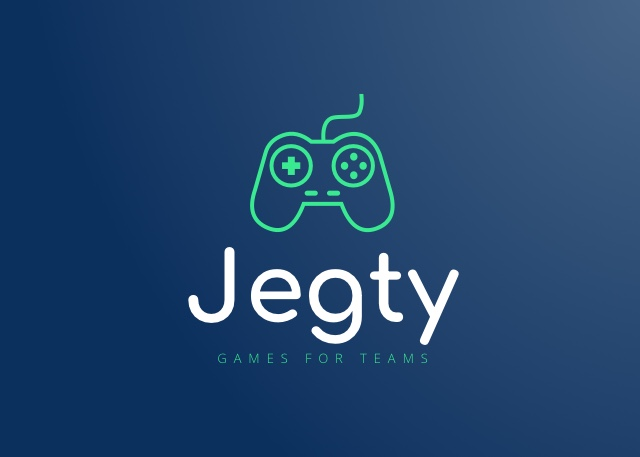

# Jegty-web
Applicación web con ReactJS 16.13.1 y Bootstrap 4

Para la página principal he pillado una template típica 
en Bootstrap 4. Y también componentes de react-material.

# Instalación en local

## Requisitos 

1. NodeJS v12.14.1 instalado en el path

## Pasos de instalación 

1. git clone del proyecto 
2. npm install o yarn install 
3. npm run start o yarn run start
4. abrir localhost:3000

# Frontend

font-awesome versión 4.3.0

2. Para la API de juegos rawg.io se usa este wrapper de la API en node. 
 https://www.npmjs.com/package/rawger

## Componentes

https://material-ui.com/es/components/autocomplete/

## MVP de Xavi

https://xd.adobe.com/view/c68b1025-a3f9-47c1-8e1d-31be4259e085-93d8/screen/f908b69e-9854-4bcb-b3b5-cd90e3751792

## TODO 

Quitar el development redux tools para cuando se vaya a prod.
Controlar los errores cuando se envia un mail.
Mirar el tema de las traducciones.
Configurar limite de gasto en firebase. https://cloud.google.com/appengine/docs/managing-costs?hl=es
Habilitar la app para Edge.